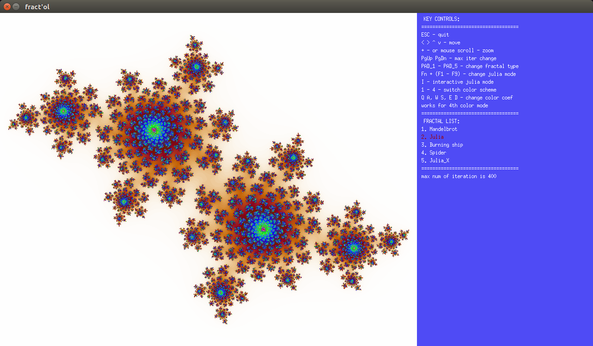

# Fract'ol - 42 (UNIT)
It is graphic project, which I developed for my learning course at UNIT.
The aim of the project is to create a small fractal exploration program.

### Requirements
- linux or macos
- installed minilibx
- libx11-dev and libxext-dev for linux
- framework OpenGL and framework AppKit for mac

### How does it work?
	git clone --recursive https://github.com/Alexandritikus/fractol
	cd fractol
	make
	./fractol [fractals name] [number of color scheme]
		fractals name: mandelbrot | julia | burning_ship | spider | julia_x
		color scheme: 1 - 4
